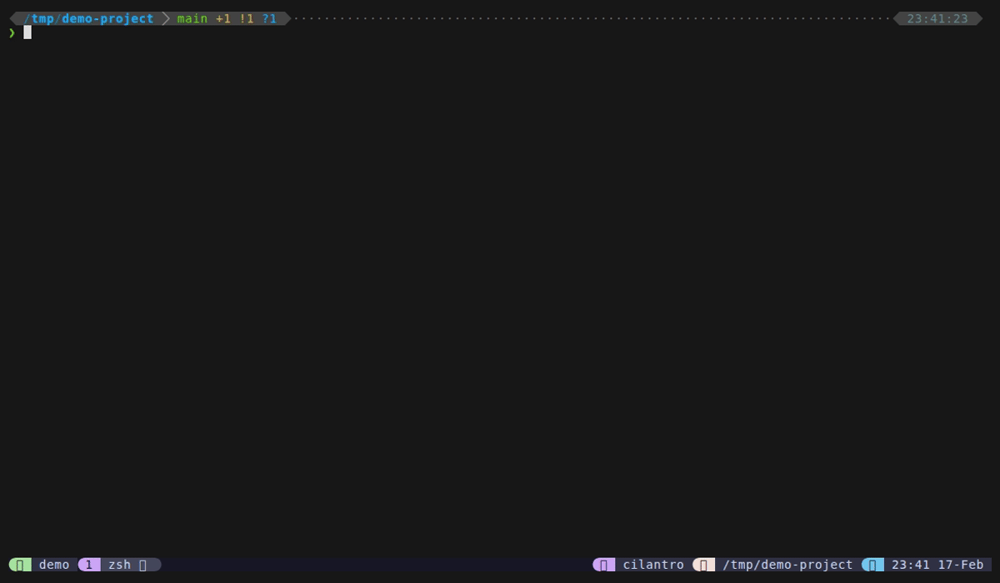

<p align="center">
  
</p>

<p align="center">
  <a href="https://github.com/ZviBaratz/tmux-dispatch/actions/workflows/ci.yml"></a>
  <a href="LICENSE"></a>
  <a href="https://github.com/ZviBaratz/tmux-dispatch/releases"></a>
  <a href="https://github.com/tmux/tmux"></a>
</p>

<h3 align="center">A unified command palette for tmux — files, grep, git, directories, sessions, scrollback, and custom commands in one popup.</h3>

<p align="center">
  
</p>

<p align="center"><i>Like VS Code's Cmd+P for tmux — type <code>&gt;</code> to grep, <code>@</code> for sessions, <code>$</code> for scrollback, <code>:</code> for commands — all without closing the popup</i></p>

<!-- Re-record: vhs tapes/demo.tape (requires https://github.com/charmbracelet/vhs) -->

## Features

- **File finder** — Find any file instantly with `fd`/`find`, `bat` preview, bookmarks (★), frecency ranking, and git status indicators
- **Live grep** — Search your entire project on every keystroke with ripgrep and line-highlighted preview
- **Git status** — Stage and unstage without leaving the popup — colored status icons, `Tab` to toggle, inline diff preview
- **Directory jump** — Jump to any recent directory with zoxide frecency — `Enter` sends `cd` to your pane
- **Session management** — Switch, create, or kill sessions without memorizing tmux commands — window grid preview shows what's running
- **Window picker** — See what's in each window before switching — pane content preview in a 2-column grid
- **Scrollback search** — Search and copy from your terminal's output history — `Enter` copies to clipboard, `Ctrl+O` pastes to pane
- **Custom commands** — Define your own command palette in `commands.conf` — run shell scripts, tmux commands, or anything you want with a fuzzy search
- **Mode switching** — Never close the popup: type `>` for grep, `@` for sessions, `!` for git, `#` for directories, `$` for scrollback, `:` for commands — backspace returns home
- **In-place actions** — Rename, delete, bookmark, multi-select, and copy without leaving the popup
- **Built-in guide** — Opening the popup shows all keybindings; press `?` in any mode for context-sensitive help

## Quick Start

Start with `Alt+o` to browse files, then explore other modes by typing prefix characters:

| Key | Action | Try it when... |
|-----|--------|----------------|
| `Alt+o` | Find files in the current directory | You want to quickly open or preview any file |
| `Alt+s` | Live grep (search file contents) | You're looking for a specific string across your project |
| `Alt+w` | Switch or create tmux sessions | You need to jump between projects or create a new workspace |

Type `>` to switch to grep, `@` to sessions, `!` to git status, `#` to directories, `$` to scrollback, `:` to commands. Backspace on empty returns home to files — just like VSCode's command palette.

**Tip:** Press `?` in any mode for context-sensitive help showing all available keybindings.

> **Alt keys not working?** Some terminals need configuration for Alt keybindings.
> Use `prefix + e` as a fallback, or see [Troubleshooting](https://zvibaratz.github.io/tmux-dispatch/reference/troubleshooting) for setup guides.

## Installation

### Via [TPM](https://github.com/tmux-plugins/tpm)

Add to your `~/.tmux.conf`:

```tmux
set -g @plugin 'ZviBaratz/tmux-dispatch'
```

Then press `prefix + I` to install.

### Manual

```bash
git clone https://github.com/ZviBaratz/tmux-dispatch.git ~/.tmux/plugins/tmux-dispatch
```

Add to `~/.tmux.conf`:

```tmux
run-shell ~/.tmux/plugins/tmux-dispatch/dispatch.tmux
```

### Dependencies

**Required:**
- **tmux** 2.6+ (3.2+ recommended for popup support)
- **bash** 4.0+ (macOS users: `brew install bash` — the default `/bin/bash` is 3.2)
- **fzf** 0.38+ (0.49+ recommended for all features)
- **perl** (required for session preview rendering)

**Strongly recommended** (enhances core features significantly):
- **fd** — faster, smarter file finding with automatic `.gitignore` respect (fallback: `find`)
- **bat** — syntax-highlighted file preview with line numbers (fallback: `head`)
- **rg** (ripgrep) — **required** for grep mode; no fallback

**Optional:**
- **zoxide** — frecency-ranked directories for `#` mode

> **Minimal install:** tmux + bash + fzf gets you file finding and session management. Add `rg` for grep, `fd`+`bat` for the best file experience.

```bash
# Install everything at once:
# macOS (Homebrew)
brew install bash fzf fd bat ripgrep zoxide

# Ubuntu / Debian
sudo apt install fzf fd-find bat ripgrep
curl -sSfL https://raw.githubusercontent.com/ajeetdsouza/zoxide/main/install.sh | sh

# Arch Linux
pacman -S fzf fd bat ripgrep zoxide

# Fedora
sudo dnf install fzf fd-find bat ripgrep
curl -sSfL https://raw.githubusercontent.com/ajeetdsouza/zoxide/main/install.sh | sh
```

## Documentation

Full documentation is available at **[zvibaratz.github.io/tmux-dispatch](https://zvibaratz.github.io/tmux-dispatch/)**.

| | | |
|---|---|---|
| [File Finder](https://zvibaratz.github.io/tmux-dispatch/modes/files) | [Live Grep](https://zvibaratz.github.io/tmux-dispatch/modes/grep) | [Git Status](https://zvibaratz.github.io/tmux-dispatch/modes/git) |
| [Directories](https://zvibaratz.github.io/tmux-dispatch/modes/dirs) | [Sessions](https://zvibaratz.github.io/tmux-dispatch/modes/sessions) | [Windows](https://zvibaratz.github.io/tmux-dispatch/modes/windows) |
| [Scrollback Search](https://zvibaratz.github.io/tmux-dispatch/modes/scrollback) | [Custom Commands](https://zvibaratz.github.io/tmux-dispatch/modes/commands) | [Mode Switching](https://zvibaratz.github.io/tmux-dispatch/features/mode-switching) |
| [Configuration](https://zvibaratz.github.io/tmux-dispatch/reference/configuration) | [Keybindings](https://zvibaratz.github.io/tmux-dispatch/reference/keybindings) | [Troubleshooting](https://zvibaratz.github.io/tmux-dispatch/reference/troubleshooting) |

## How is this different?

Most tmux fuzzy-finder plugins provide a menu of separate tmux operations (sessions, windows, panes, commands) where each action opens a new picker. tmux-dispatch takes a different approach:

- **Unified popup** — Files, grep, git, directories, and sessions all live in a single popup. No closing and reopening for different tasks.
- **No-close mode switching** — Type a prefix character (`>`, `@`, `!`, `#`, `$`, `:`) to switch modes instantly. Backspace on empty returns home. The popup stays open throughout.
- **Frecency ranking** — Recently and frequently opened files appear first, so your most-used files are always within reach.
- **Inline git staging** — Stage and unstage files with `Tab` directly in the git status view, with an inline diff preview. No need to drop to the command line.
- **Bookmarks** — Pin important files with `Ctrl+B` so they always appear at the top of the file list.
- **Scrollback search** — Grab commands, paths, or output from your terminal history without a separate plugin. Search, multi-select, copy to clipboard, or paste directly into your pane.
- **Custom command palette** — Define your own commands in a simple config file and run them with fuzzy search. Shell scripts, tmux commands, project-specific workflows — all one prefix away.
- **Replaces 3-4 plugins** — Between file finding, grep, git staging, session management, scrollback search, and custom commands, tmux-dispatch replaces what would otherwise require extrakto + tmux-fzf + tmux-which-key (or similar).

## Changelog

See [CHANGELOG.md](CHANGELOG.md) for a full list of changes in each release.

## Similar Projects

- [sainnhe/tmux-fzf](https://github.com/sainnhe/tmux-fzf) — fzf-based tmux management (sessions, windows, panes, commands). Complementary to tmux-dispatch.
- [laktak/extrakto](https://github.com/laktak/extrakto) — Extract text/URLs from terminal scrollback. tmux-dispatch's scrollback mode covers this use case.
- [joshmedeski/sesh](https://github.com/joshmedeski/sesh) — Go-based tmux session manager with zoxide integration
- [alexwforsythe/tmux-which-key](https://github.com/alexwforsythe/tmux-which-key) — Hierarchical keybinding menu for tmux commands. tmux-dispatch's commands mode provides similar functionality.
- [wfxr/tmux-fzf-url](https://github.com/wfxr/tmux-fzf-url) — Open URLs from terminal output via fzf
- [junegunn/fzf](https://github.com/junegunn/fzf) — The fuzzy finder that powers tmux-dispatch (includes built-in `fzf-tmux`)

## License

MIT
