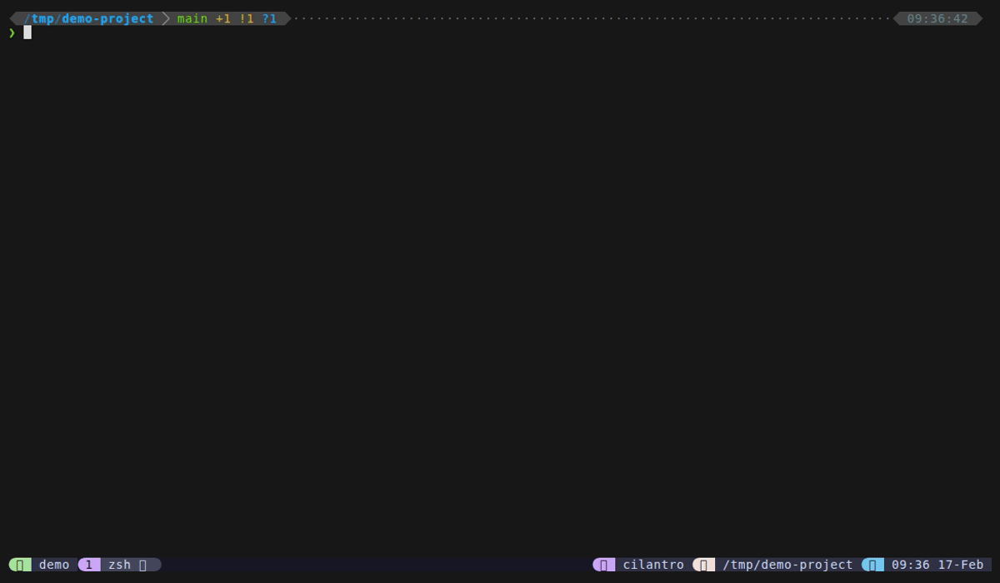
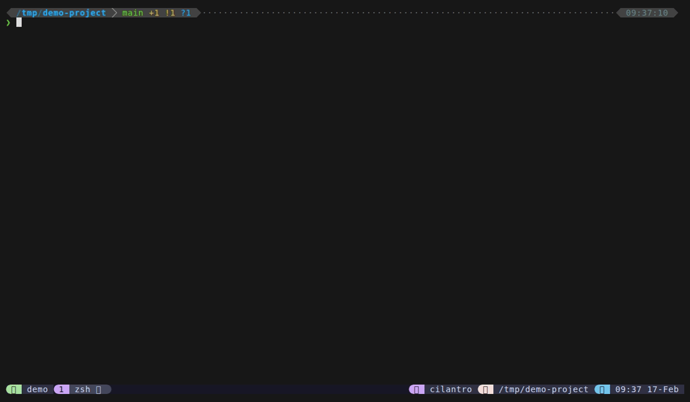
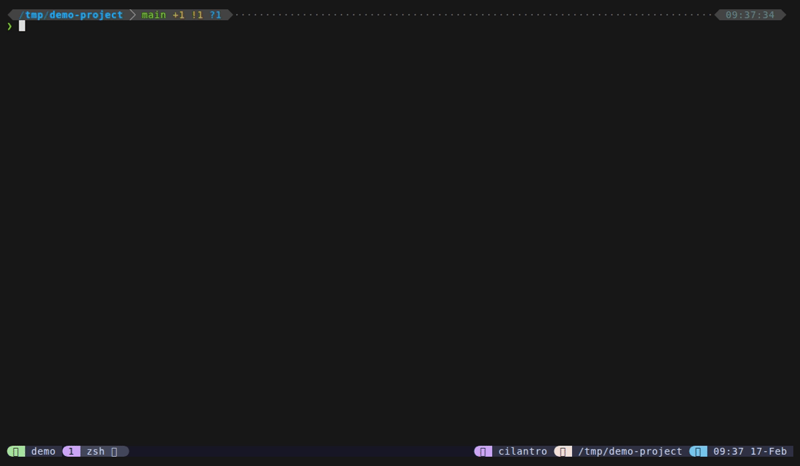

<p align="center">
  
</p>

<p align="center">
  <a href="https://github.com/ZviBaratz/tmux-dispatch/actions/workflows/ci.yml"></a>
  <a href="LICENSE"></a>
  <a href="https://github.com/ZviBaratz/tmux-dispatch/releases"></a>
  <a href="https://github.com/tmux/tmux"></a>
</p>

<h3 align="center">One popup. Nine modes. Zero context switching.</h3>

<p align="center">
  
</p>

<p align="center"><i>Like Cmd+P for tmux — type a prefix to switch modes, never close the popup</i></p>

<!-- Re-record: vhs tapes/demo.tape (requires https://github.com/charmbracelet/vhs) -->

## What's inside

| | |
|---|---|
| **File finder** — fd/find + bat preview, bookmarks, frecency | **Live grep** — Ripgrep on every keystroke, line-highlighted preview |
|  |  |
| **Git status** — Stage/unstage with Tab, inline diff | **Sessions** — Switch, create, kill with window preview |
|  |  |

**Plus:** [Directory jump](https://zvibaratz.github.io/tmux-dispatch/modes/dirs) via zoxide (`#`) | [Window picker](https://zvibaratz.github.io/tmux-dispatch/modes/windows) with pane preview | [Scrollback search](https://zvibaratz.github.io/tmux-dispatch/modes/scrollback) with copy/paste (`$`) | [Custom commands](https://zvibaratz.github.io/tmux-dispatch/modes/commands) from a config file (`:`) | [Mode switching](https://zvibaratz.github.io/tmux-dispatch/features/mode-switching) via prefix characters | [Bookmarks](https://zvibaratz.github.io/tmux-dispatch/features/bookmarks) with `Ctrl+B`

## Quick Start

Press `Alt+o` to open the file finder. From there, type a prefix character to switch modes instantly:

| Prefix | Mode | What it does |
|--------|------|--------------|
| _(default)_ | Files | Fuzzy file finder with preview |
| `>` | Grep | Live ripgrep across all files |
| `@` | Sessions | Switch, create, or kill tmux sessions |
| `!` | Git | Stage/unstage files, inline diff |
| `#` | Dirs | Jump to directories via zoxide |
| `$` | Scrollback | Search terminal history lines |
| `&` | Tokens | Extract URLs, paths, hashes from scrollback |
| `:` | Commands | Run your custom command palette |
| `~` | Home files | File finder rooted at `$HOME` |

Backspace on empty returns home to files — just like VSCode's command palette.

**Tip:** Press `?` in any mode for context-sensitive help showing all available keybindings.

> **Alt+o not working?** Some terminals need configuration for Alt keybindings.
> Use `prefix + e` as a fallback, or see [Troubleshooting](https://zvibaratz.github.io/tmux-dispatch/reference/troubleshooting) for setup guides.

## Installation

### Via [TPM](https://github.com/tmux-plugins/tpm)

Add to your `~/.tmux.conf`:

```tmux
set -g @plugin 'ZviBaratz/tmux-dispatch'
```

Then press `prefix + I` to install.

### Manual

```bash
git clone https://github.com/ZviBaratz/tmux-dispatch.git ~/.tmux/plugins/tmux-dispatch
```

Add to `~/.tmux.conf`:

```tmux
run-shell ~/.tmux/plugins/tmux-dispatch/dispatch.tmux
```

### Dependencies

**Required:**
- **tmux** 2.6+ (3.2+ recommended for popup support)
- **bash** 4.0+ (macOS users: `brew install bash` — the default `/bin/bash` is 3.2)
- **fzf** 0.38+ (0.49+ recommended for all features)
- **perl** (required for session preview rendering)

**Strongly recommended** (enhances core features significantly):
- **fd** — faster, smarter file finding with automatic `.gitignore` respect (fallback: `find`)
- **bat** — syntax-highlighted file preview with line numbers (fallback: `head`)
- **rg** (ripgrep) — **required** for grep mode; no fallback

**Optional:**
- **zoxide** — frecency-ranked directories for `#` mode

> **Minimal install:** tmux + bash + fzf gets you file finding and session management. Add `rg` for grep, `fd`+`bat` for the best file experience.

```bash
# Install everything at once:
# macOS (Homebrew)
brew install bash fzf fd bat ripgrep zoxide

# Ubuntu / Debian
sudo apt install fzf fd-find bat ripgrep
curl -sSfL https://raw.githubusercontent.com/ajeetdsouza/zoxide/main/install.sh | sh

# Arch Linux
pacman -S fzf fd bat ripgrep zoxide

# Fedora
sudo dnf install fzf fd-find bat ripgrep
curl -sSfL https://raw.githubusercontent.com/ajeetdsouza/zoxide/main/install.sh | sh
```

## Replaces your plugin stack

| Without tmux-dispatch | With tmux-dispatch |
|---|---|
| extrakto (scrollback) | `$` scrollback mode |
| tmux-fzf (sessions/windows) | `@` sessions mode |
| tmux-which-key (commands) | `:` commands mode |
| fzf + fd (file finding) | Default mode |
| rg (project grep) | `>` grep mode |
| **5 plugins, 5 keybindings** | **1 plugin, 1 keybinding** |

## Documentation

Full documentation at **[zvibaratz.github.io/tmux-dispatch](https://zvibaratz.github.io/tmux-dispatch/)**.

| | | |
|---|---|---|
| [File Finder](https://zvibaratz.github.io/tmux-dispatch/modes/files) | [Live Grep](https://zvibaratz.github.io/tmux-dispatch/modes/grep) | [Git Status](https://zvibaratz.github.io/tmux-dispatch/modes/git) |
| [Directories](https://zvibaratz.github.io/tmux-dispatch/modes/dirs) | [Sessions](https://zvibaratz.github.io/tmux-dispatch/modes/sessions) | [Windows](https://zvibaratz.github.io/tmux-dispatch/modes/windows) |
| [Scrollback Search](https://zvibaratz.github.io/tmux-dispatch/modes/scrollback) | [Custom Commands](https://zvibaratz.github.io/tmux-dispatch/modes/commands) | [Mode Switching](https://zvibaratz.github.io/tmux-dispatch/features/mode-switching) |
| [Configuration](https://zvibaratz.github.io/tmux-dispatch/reference/configuration) | [Keybindings](https://zvibaratz.github.io/tmux-dispatch/reference/keybindings) | [Troubleshooting](https://zvibaratz.github.io/tmux-dispatch/reference/troubleshooting) |

## Changelog

See [CHANGELOG.md](CHANGELOG.md) for a full list of changes in each release.

## Similar Projects

[sainnhe/tmux-fzf](https://github.com/sainnhe/tmux-fzf) | [laktak/extrakto](https://github.com/laktak/extrakto) | [joshmedeski/sesh](https://github.com/joshmedeski/sesh) | [alexwforsythe/tmux-which-key](https://github.com/alexwforsythe/tmux-which-key) | [wfxr/tmux-fzf-url](https://github.com/wfxr/tmux-fzf-url) | [junegunn/fzf](https://github.com/junegunn/fzf)

## License

MIT
