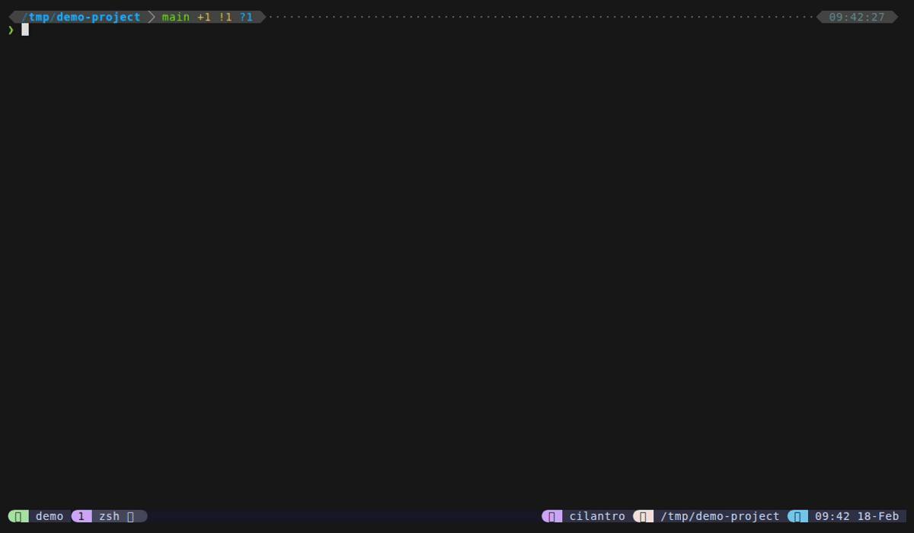

# Mode Switching



Mode switching is tmux-dispatch's core navigation concept, inspired by VS Code's command palette. Files mode is always "home" -- the starting point whenever you open the popup. From there, type a prefix character to switch to any other mode. The remainder of your typed text becomes the query in the new mode, so you can start searching the moment you arrive.

This works via fzf's `become` action: when a prefix is detected in the `change:transform` binding, fzf replaces itself with a new `dispatch.sh` invocation in the target mode, preserving the query (minus the prefix character). The transition is seamless -- fzf terminates and restarts in the new mode within the same popup window.

## Prefix Characters

| Prefix | Target Mode | Example |
|--------|-------------|---------|
| `>` | Live Grep | Type `>useState` to search for "useState" |
| `@` | Sessions | Type `@api` to filter sessions containing "api" |
| `!` | Git Status | Type `!` to see changed files |
| `#` | Directories | Type `#src` to filter directories containing "src" |
| `$` | Scrollback Search | Type `$error` to search scrollback for "error" |
| `:` | Custom Commands | Type `:deploy` to filter your command palette |
| `~` | Files from Home | Type `~` to browse files under `$HOME` |

Prefixes are only detected when typed as the first character in the query. If you're filtering files and your query starts with one of these characters, mode switching activates immediately.

## How It Works

Here is the full flow when you switch from files to grep:

1. You're in files mode (prompt: `  `)
2. You type `>query`
3. The `change:transform` binding detects the `>` prefix in the query
4. fzf executes `become(dispatch.sh --mode=grep --pane=ID --query=">query")`
5. The current fzf process terminates and a new `dispatch.sh` launches in grep mode
6. Grep mode strips the leading `>`, leaving "query" as the search term
7. fzf starts in grep mode (prompt: `> `) with "query" pre-filled and results already loaded

The same mechanism works for all prefix characters -- each maps to a different `--mode` argument.

## Backspace-to-Home

All sub-modes (grep, git, dirs, sessions, scrollback, commands) use fzf's `backward-eof` binding. When backspace is pressed on an empty query, fzf executes `become(dispatch.sh --mode=files)` to return to the file finder.

This creates a natural navigation pattern:

- **files** --> type `>query` --> **grep** (with query pre-filled)
- **grep** --> backspace on empty --> **files**
- **files** --> type `@` --> **sessions** --> `Ctrl+W` --> **windows** --> backspace --> **sessions** --> backspace --> **files**
- **files** --> type `$error` --> **scrollback** (searching for "error") --> backspace on empty --> **files**
- **files** --> type `:deploy` --> **commands** (filtered to "deploy") --> backspace on empty --> **files**
- **files** --> type `~` --> **files (from $HOME)**

You can always get back to files mode by clearing the query and pressing backspace. Alternatively, pressing `Escape` closes the popup entirely from any mode.

## Query Forwarding

When you switch modes via prefix, the text you've already typed (minus the prefix character) is forwarded as the initial query. This means:

- In files mode, type `>Hello` --> grep opens with query "Hello" and results already loaded
- In files mode, type `@api` --> sessions opens with query "api" filtering the session list
- In files mode, type `#src` --> directories opens with query "src" filtering directories
- In files mode, type `$error` --> scrollback opens with query "error" filtering scrollback lines
- In files mode, type `:deploy` --> commands opens with query "deploy" filtering the command list
- In files mode, type `~` --> files opens with `$HOME` as the working directory

This is particularly useful for grep mode, where the query triggers an immediate ripgrep search. You can type `>functionName` in files mode and arrive in grep mode with matching results already visible.

## The Welcome Cheat Sheet

When files mode opens with no query (or when the query becomes empty), a welcome cheat sheet appears in the preview panel. It shows all available prefix characters and keybindings as a quick reference:

```
  FILES
  ─────────────────────────────
  enter     open in editor
  S-tab     multi-select
  ^O        send to pane
  ^Y        copy path
  ^B        toggle bookmark
  ^H        toggle hidden files
  ^R        rename file
  ^X        delete file
  ^D/^U     scroll preview

  MODE SWITCHING
  ─────────────────────────────
  >...      grep code
  @...      switch sessions
  !...      git status
  #...      directories
  $...      scrollback search
  :...      custom commands
```

The cheat sheet disappears as soon as you start typing or navigate the file list. When the cheat sheet is visible, the border label reads "dispatch" and the preview label reads "guide". Once you start interacting, these change to "files" and "preview" respectively.

## Mode Prompts

Each mode has a distinct prompt character so you always know where you are:

| Mode | Prompt |
|------|--------|
| Files | `  ` (two spaces) |
| Grep | `> ` |
| Git | `! ` |
| Directories | `# ` |
| Sessions | `@ ` |
| Scrollback | `$ ` |
| Commands | `: ` |
| Windows | `  ` (two spaces) |
