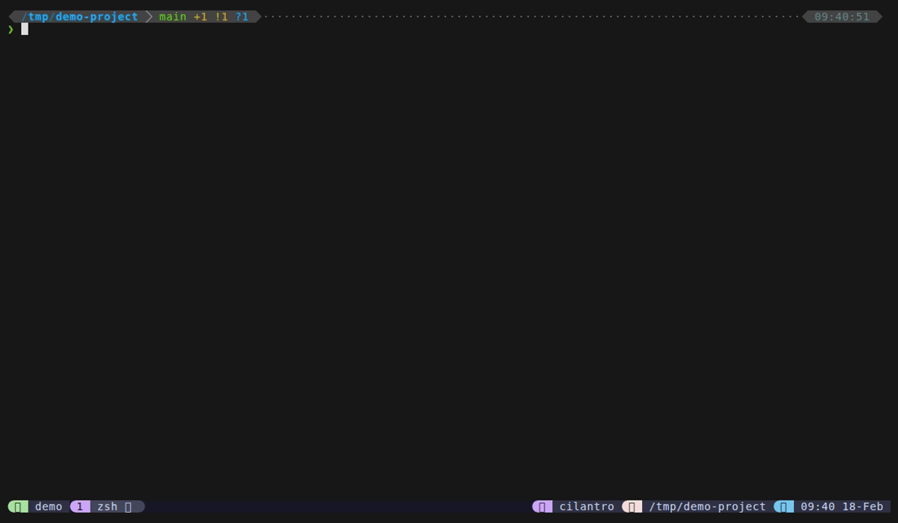

# Directories

Directory jump mode lets you quickly navigate to any directory. It uses zoxide's frecency-ranked directory list when available, falling back to fd or find. Selecting a directory sends `cd <path>` to your originating pane.

**How to access:** Type `#` from files mode, or set a direct keybinding.

## Keybindings

| Key | Action |
|-----|--------|
| `Enter` | Send `cd <directory>` to originating pane |
| `Ctrl+Y` | Copy directory path to clipboard |
| `Backspace` on empty | Return to files (home) |
| `Ctrl+D` / `Ctrl+U` | Scroll preview down/up |
| `Escape` | Close popup |

## Features

- **Zoxide integration** -- when zoxide is installed, directories are listed from `zoxide query --list`, ranked by frecency (most used/recent first). Paths under `$HOME` display with `~` prefix for readability.
- **Fallback chain** -- zoxide > fd (list directories) > find (list directories). Always works even without optional tools.
- **Tree/ls preview** -- shows directory contents via `tree -C -L 2` if tree is installed, otherwise `ls -la` with color detection for GNU vs BSD ls.
- **Backspace-to-home** -- returns to files mode via fzf's become action. See [Mode Switching](../features/mode-switching) for details.

## Configuration

There are no mode-specific configuration options for directory jump. The directory listing tool is auto-detected.

## Tips

- Install zoxide for the best experience -- it ranks directories you actually use most frequently.
- Without zoxide, the mode lists directories from the current working directory via fd/find.
- Selecting a directory sends the cd command directly to your pane -- you don't need to type anything.
- Paths with `~` are expanded back to `$HOME` before sending the cd command.
