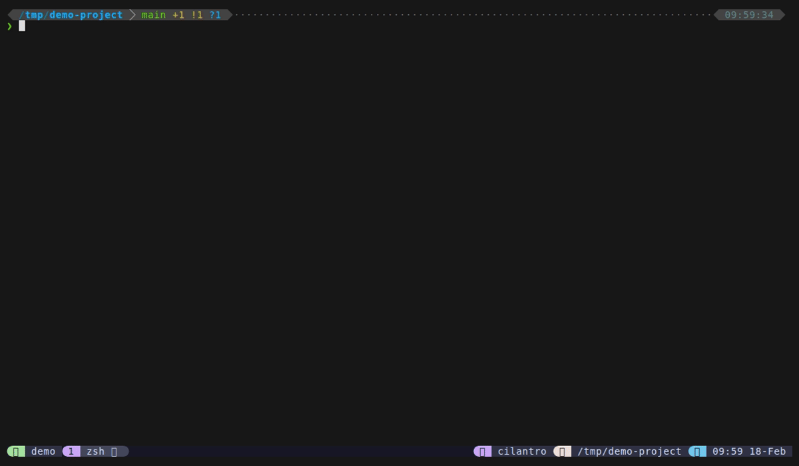

# Sessions

Session mode is the hub for tmux session management. Switch between sessions, create new ones by typing a name, kill sessions, launch project-based sessions, browse windows, and rename -- all from the same popup.

**How to access:** Press `Alt+w` directly, type `@` from files mode, or set a custom keybinding.

**Session list format:** Each session shows: `name · Nw · age [· attached] [· current]` where N is the window count, age is relative time since last activity (e.g., "5m", "2h"), "attached" appears if a client is connected, and "current" (in green) marks the session you're in.

## Keybindings

| Key | Action |
|-----|--------|
| `Enter` | Switch to selected session (or create if name doesn't exist) |
| `Ctrl+K` | Kill selected session (refuses to kill current) |
| `Ctrl+N` | Create session from project directory picker |
| `Ctrl+W` | Browse windows for selected session |
| `Ctrl+Y` | Copy session name to clipboard |
| `Ctrl+R` | Rename session inline |
| `Backspace` on empty | Return to files (home) |
| `Ctrl+D` / `Ctrl+U` | Scroll preview down/up |
| `?` | Show help cheat sheet in preview |
| `Escape` | Close popup |

## Features

- **Session preview** -- shows a 2-column grid of window boxes, each containing a snapshot of the active pane's content (rendered by session-preview.sh using perl for ANSI-aware width handling). Active window boxes are bright white, inactive ones are dimmed. See [Preview System](../features/previews) for details.
- **Create-on-Enter** -- if you type a session name that doesn't exist and press Enter, it creates the session and switches to it.
- **Kill protection** -- `Ctrl+K` refuses to kill the current session (shows "Cannot kill current session").
- **Backspace-to-home** -- returns to files mode via fzf's become action. See [Mode Switching](../features/mode-switching) for details.

## Sub-modes

Session mode provides access to three sub-modes, each launched from within the session picker.

### Project Launcher (Ctrl+N)

Opens a directory picker showing subdirectories from configured project paths. Select a directory to create a new session named after it (dots and colons are sanitized to hyphens). If a session with that name already exists, switches to it instead.

Project directories are configured via `@dispatch-session-dirs` (colon-separated paths, default: `$HOME/Projects`).

The preview shows `tree -C -L 2` or `ls -la` of each directory.

### Window Picker (Ctrl+W)

Opens a window list for the selected session showing: `index: name [*] (N panes)` where `*` marks the active window. Preview shows the active pane's content snapshot. Select a window to switch to that session and window.

Backspace returns to session mode.

See the dedicated [Windows](windows) page for details.

### Rename Session (Ctrl+R)

Enters inline rename mode -- the current session name becomes the fzf query. Edit the name and press Enter to confirm. The preview shows a live diff (old name -> new name) with availability check. Conflict detection prevents renaming to an existing session name.

Escape cancels and returns to session mode.

## Configuration

| Option | Default | Description |
|--------|---------|-------------|
| `@dispatch-session-key` | `M-w` | Keybinding to open sessions directly |
| `@dispatch-session-prefix-key` | `none` | Prefix keybinding for sessions |
| `@dispatch-session-dirs` | `$HOME/Projects` | Colon-separated directories for Ctrl+N project picker |

## Tips

- Type a new session name and press Enter to create it instantly -- no need for Ctrl+N if you don't need a project directory.
- The preview grid shows real pane content, making it easy to identify which session has what.
- Use Ctrl+N with `@dispatch-session-dirs "$HOME/Projects:$HOME/work"` to pick from multiple project roots.
- Session names with dots or colons are automatically sanitized (replaced with hyphens) since tmux doesn't allow those characters.
